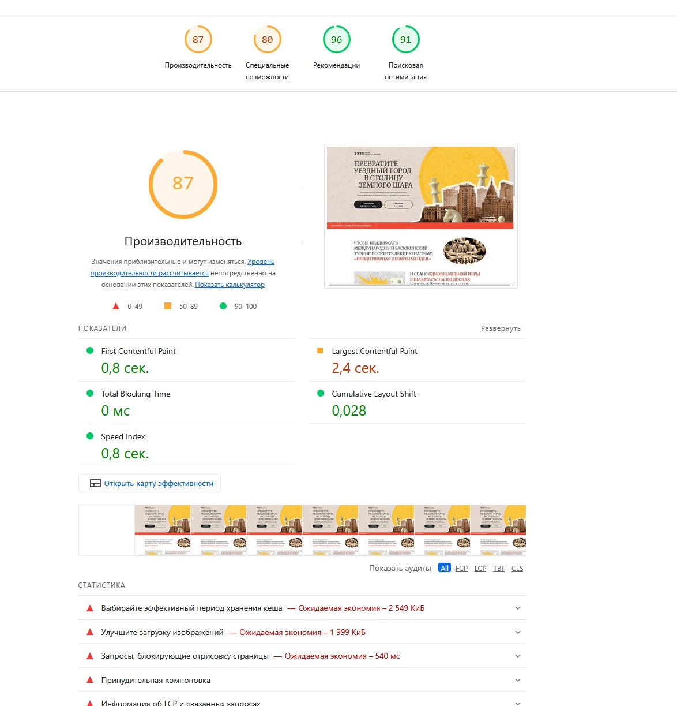
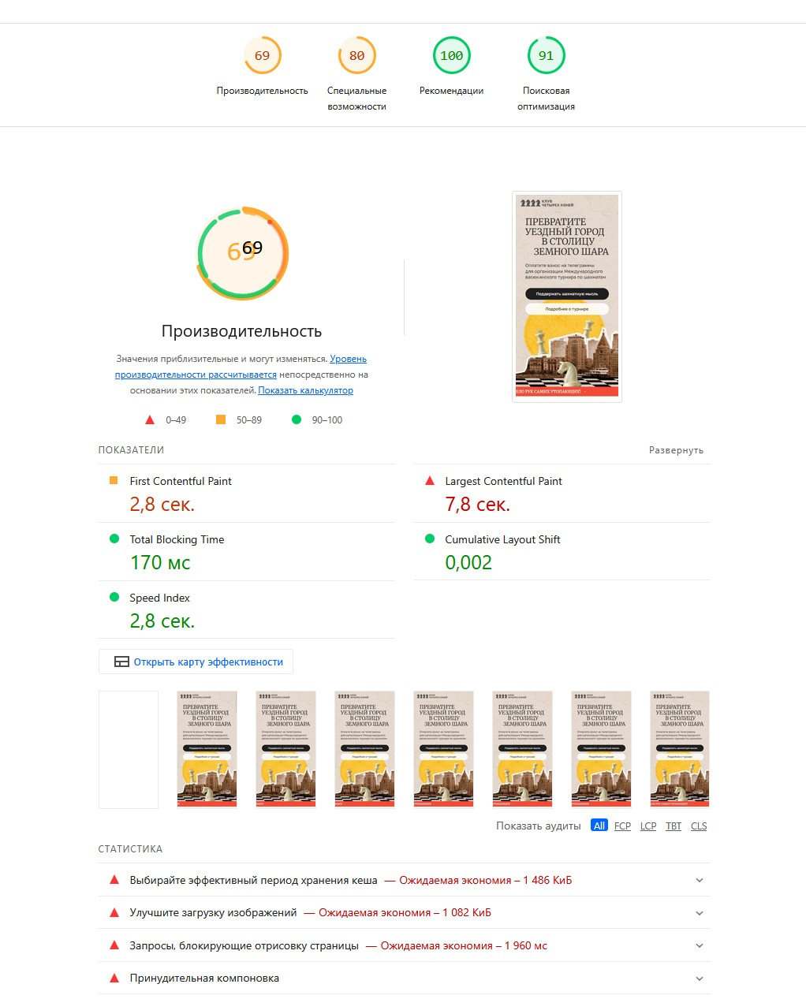

# Отчёт о тестировании лендинга «Международный васюкинский турнир»

| Параметр | Значение |
|----------|----------|
| Дата проведения | 27–28 апреля 2026 г. |
| Автор | Скиба Н.Н. |
| Версия отчёта | 1.0 |
| Ссылка на тестируемый сайт | Архив с исходными файлами (после распаковки открыть index.html) |
| Макет Figma | [Дизайн для вёрстки – тестовый лендинг](https://www.figma.com/design/0xXfupPNU3aZxPqFbmhCKb/Дизайн-для-верстки-) |

---

## 1. Цель и объём тестирования

**Цель** – проверить сайт на соответствие макету Figma, качество вёрстки, производительность, адаптивность, кросс-браузерную совместимость и техническую корректность.

**Объём** – протестированы:
- Производительность (Lighthouse для десктопа и мобильных)
- Адаптивность (разрешения 320px, 375px, 768px, 1366px, 1920px)
- Кросс-браузерность (Chrome, Firefox, Яндекс.Браузер, Samsung Internet, Safari WebKit)
- Соответствие макету Figma (Pixel perfect на десктопе 1366px, мобилке 375px, частично 1920px)
- Качество кода (HTML/CSS/JS – семантика, брейкпоинты, логика скриптов)

---

## 2. Инструменты и окружение

| Инструмент / Браузер | Версия / Параметры | Примечание |
|----------------------|--------------------|-------------|
| Chrome (основной) | 124.0.6367.119 | DevTools эмуляция устройств |
| Firefox | 125.0.3 | Адаптивность, клавиатурная навигация |
| Яндекс.Браузер | 24.4.1 | Кросс-браузерность |
| Samsung Internet | 25.0 (через BrowserStack) | Кросс-браузерность, мобильная верстка |
| Safari (WebKit) | Playwright 1.40.0, эмуляция iPhone 12, iOS 15.5 | iOS-подобное окружение (реальный Safari не использовался) |
| Lighthouse | 13.0.1 (встроенный в Chrome) | Режимы десктоп / мобила |
| Разрешения экранов | 320×568, 375×667, 768×1024, 1366×768, 1920×1080 | Соответствие ключевым брейкпоинтам |

---

## 3. Производительность (Lighthouse)

### 3.1. Десктоп



| Категория | Оценка | Статус |
|-----------|--------|--------|
| ⚡ Производительность | 0.87 | 🟡 Средне |
| ♿ Специальные возможности | 0.80 | 🟡 Средне |
| ✅ Лучшие практики | 0.96 | 👍 Отлично |
| 🔍 SEO | 0.91 | 👍 Отлично |

**Ключевые метрики:**
- LCP (2.4 с) – близок к порогу 2.5 с, требует оптимизации
- Самые тяжёлые ресурсы: hero-desk.png (1.6 МБ), шрифты Google Fonts (710 КБ)

**Основные проблемы:**
- Избыточный вес изображений
- Отсутствие кэширования
- Блокирующие отрисовку CSS

### 3.2. Мобильное устройство



| Категория | Оценка | Статус |
|-----------|--------|--------|
| ⚡ Производительность | 0.69 | 🟡 Средне |
| ♿ Специальные возможности | 0.80 | 🟡 Средне |
| ✅ Лучшие практики | 1.0 | 👍 Отлично |
| 🔍 SEO | 0.91 | 👍 Отлично |

**Ключевые метрики:**
- LCP – 7.8 с (критично, должно быть ≤2.5 с). LCP-элемент: hero-mobile.png (480 КБ)
- TBT – 170 мс (требует внимания)

**Основные проблемы:**
- Огромный вес неоптимизированных мобильных изображений (hero-mobile.png 480 КБ, шрифты >690 КБ)
- Полное отсутствие кэширования статики
- Длинные задачи в основном потоке (скрипты карусели и слайдера)

---

## 4. Адаптивность и кросс-браузерность

### 4.1. Кросс-браузерное тестирование

| Браузер / Платформа | Версия / Окружение | Найденные расхождения | Статус |
|---------------------|--------------------|------------------------|--------|
| Firefox | 125.0.3 (Windows) | Отображение сетки этапов, обрезка текста в мобильной версии (размер 320px) | ⚠️ Проблемы |
| Яндекс.Браузер | 24.4.1 (Windows) | Идентичен Chrome, микросдвиги в карусели участников | 🟡 Незначительно |
| Samsung Internet | 25.0 (BrowserStack, Galaxy S21) | Эмуляция мобильного устройства – проблемы с сенсорным управлением карусели, наложение элементов | ⚠️ Проблемы |
| Safari (WebKit) | Playwright 1.40.0, эмуляция iPhone 12, iOS 15.5 | Несоответствие блока «Этапы преображения Васюков» (текст выходит за границы, не центрируется) на 375px | ❌ Критично |

> **Ограничение тестирования:** реальный браузер Safari на macOS не использовался. Тест проведён в эмуляции WebKit через Playwright. При проверке на нативном Safari возможны дополнительные расхождения.

### 4.2. Адаптивность на ключевых разрешениях

**📱 320px (iPhone SE / Firefox)**
- Заголовок не соответствует макету (размер, перенос строк)
- В блоке «Чтобы поддержать Международный васюкинский турнир» текст обрезается
- Карточка участника турнира обрезается по ширине
- **Вывод:** вёрстка для 320px отсутствует

**📱 375px (мобильный макет)**
- Шапка: высота 97px вместо ~70px – лишние 30px сдвигают контент
- Бегущие строки содержат только 1–2 фразы (должно быть 3)
- Футер: недостаточная высота, текст прижат к низу
- Декоративные слои (шахматы, эллипсы, марка) отсутствуют – вместо них одиночные фоновые изображения

**📱 768px (планшет)**
- Блок «Этапы преображения Васюков»: сетка отображается некорректно, текст в карточках обрезается справа
- Планшетный диапазон не проработан ни в макете Figma, ни в вёрстке – высокий риск ошибок

**💻 1366px (десктоп – базовая ширина)**
- Основные несоответствия: высота шапки (97px вместо 64px)
- Бегущие строки вложены в hero (должны быть после)
- Секция поддержки турнира содержит дублирующий блок .mob
- Отсутствуют фоновые слои
- Титул Остапа Бендера – «Чемпион мира» вместо «Гроссмейстер»

**💻 1920px (широкий экран)**
- Контент центрирован внутри max-width: 1366px – боковые поля не соответствуют макету Figma
- Логотип имеет смещение ~44px относительно макета
- Декоративные слои (жёлтый эллипс, шахматы, город) полностью отсутствуют

📸 **Скриншоты проблем** находятся в папке `screenshots` (файлы: `768px_timeline_broken.png`, `1920px_header_only.png`, `safari_webkit_375px_timeline.png`).

---

## 5. Соответствие вёрстки макету Figma (Pixel Perfect)

### 5.1. Десктоп (1366px) – основные расхождения

| Блок | Несоответствие | Критичность |
|------|----------------|-------------|
| Шапка | Высота 97px вместо 64px; логотип центрирован, а должен быть top:26px | 🔴 Высокая |
| Бегущие строки | Спрятаны внутри hero; содержат 1–2 фразы (нужно 3); вторая бегущая строка отсутствует | 🔴 Высокая |
| Секция поддержки турнира | В DOM два блока (.tournament-section__item и лишний .mob) вместо одного | 🔴 Высокая |
| Фон | Сложный многослойный фон (эллипс, шахматы, город, марка) заменён одним изображением hero-desk.png | 🔴 Высокая |
| Карточки участников | У всех одинаковое фото; отсутствует круглая подложка 320px и марка Cooper Union; у Бендера неверный титул | 🔴 Высокая |
| Этапы | Подзаголовок переносится JS-костылём; фон карточек – bg-card-mob.png (не тот рисунок); изображение самолёта не соответствует макету | 🟡 Средняя |
| Футер | Высота ~138px (нужно 150px) – незначительно | 🟢 Низкая |

### 5.2. Мобильная версия (375px) – основные расхождения

| Блок | Несоответствие | Критичность |
|------|----------------|-------------|
| Шапка | Высота 97px вместо ~70px | 🟡 Средняя |
| Бегущие строки | Неполный набор фраз | 🔴 Высокая |
| Футер | Высота блока меньше макетной (текст прижат к низу) | 🟡 Средняя |
| Декоративные слои | Полностью отсутствуют (только hero-mobile.png) | 🔴 Высокая |

### 5.3. Ширина 1920px (частичное соответствие)

**Критично:** позиционирование логотипа и контента, отсутствие декоративных слоёв.  
**Рекомендация:** согласовать с дизайнером поведение на широких экранах (резина или фиксированная ширина).

---

## 6. Качество кода (HTML/CSS/JS)

### 6.1. HTML – семантика и доступность

| Проблема | Наличие | Рекомендация |
|----------|---------|---------------|
| lang="en" при русском контенте | ❌ | Заменить на lang="ru" |
| Отсутствует `<main>` | ⚠️ | Обернуть основной контент |
| Ссылки-кнопки вместо `<button>` | ⚠️ | Для действий использовать `<button>` |
| Пустые href="#" у .btn__learn-more | ⚠️ | Удалить или заменить на реальные ссылки |
| Контрастность текста (например, .total-count) | ❌ | Увеличить контраст до ≥4.5:1 |
| Кнопки карусели без aria-label | ❌ | Добавить доступные имена |

### 6.2. CSS – брейкпоинты, адаптивность

| Проблема | Наличие | Рекомендация |
|----------|---------|---------------|
| Фиксация .container на max-width: 37.5rem | ❌ | Заменить на width: 100% + паддинги |
| Десктопный брейкпоинт с 768px (должен с 1024px) | ⚠️ | Сменить на min-width: 1024px |
| Планшетный диапазон (768–1024px) не проработан | ❌ | Добавить стили или медиа-запросы |
| Отсутствует адаптация под 320px | ❌ | Добавить @media (max-width: 374px) |
| Картинка .slider__card_img перекрывает текст (z-index) | ❌ | Уменьшить z-index / изменить позиционирование |

### 6.3. JavaScript – критические ошибки

| Проблема | Влияние | Приоритет |
|----------|---------|-----------|
| media.js перестраивает DOM при ресайзе (innerHTML) | Потеря обработчиков событий, конфликт слайдеров | 🔴 Критичный |
| slider.js и media.js конфликтуют: на десктопе уничтожается слайдер | Кнопки перестают работать | 🔴 Критичный |
| Авто-пролистывание карусели не отключается на мобильных | Невозможно остановить авто-скролл | 🟡 Средний |
| Сброс currentIndex=0 при ресайзе | Пользователь теряет позицию | 🟡 Средний |

**Рекомендация:** удалить `media.js`, всю адаптацию перенести на CSS Grid/Flex, отказаться от перестроения DOM на JavaScript.

---

## 7. Сводная таблица дефектов

| ID | Описание | Блок | Приоритет | Статус |
|----|----------|------|-----------|--------|
| BUG-06 | Конфликт slider.js и media.js, перестройка DOM при ресайзе | JS | 🔴 Critical | Open |
| BUG-01 | Отсутствуют многослойные декоративные фоны | Весь сайт | 🔴 High | Open |
| BUG-02 | Бегущие строки содержат неполный набор фраз | Hero + перед футером | 🔴 High | Open |
| BUG-03 | Неверная структура секции поддержки турнира (лишний блок .mob) | Десктоп | 🔴 High | Open |
| BUG-04 | Высота шапки 97px вместо 64px на десктопе; на мобилке лишние 30px | Header | 🔴 High | Open |
| BUG-05 | Карточки участников: одинаковые фото, нет круглой подложки, у Бендера неверный титул | Карусель участников | 🔴 High | Open |
| BUG-07 | Вёрстка для 320px отсутствует (текст обрезается, карточки вылезают) | Адаптивность | 🔴 High | Open |
| BUG-08 | На планшете (768px) сетка этапов ломается, текст обрезается справа | Этапы | 🟡 Medium | Open |
| BUG-09 | Отсутствует `<main>`, не хватает доступных имён для кнопок | Accessibility | 🟡 Medium | Open |
| BUG-10 | Авто-пролистывание карусели не отключается на мобильных | Карусель участников | 🟡 Medium | Open |

---

## 8. Рекомендации по исправлению (по приоритетам)

### 🔴 Критичные / High (исправить в первую очередь)

1. **Удалить media.js** – перенести всю адаптацию на CSS Grid/Flex
2. **Восстановить многослойные фоны** согласно Figma (абсолютное позиционирование, mix-blend-mode)
3. **Привести шапку к макету** – высота 64px на десктопе, логотип top:26px; на мобилке убрать фиксированную высоту
4. **Исправить бегущие строки** – добавить недостающие фразы (три фразы с разделителями-кружками), вынести из hero в отдельный блок
5. **Переделать секцию поддержки турнира** – оставить один блок с текстом и одним изображением, удалить лишний .mob
6. **Добавить адаптивность под 320px** – медиа-запрос, резиновые отступы, перенос текста

### 🟡 Средний приоритет

1. **Внедрить адаптивные изображения** – использовать srcset и sizes, конвертировать PNG в WebP/AVIF
2. **Добавить правильные брейкпоинты** – 320px, 768px, 1024px, 1366px, 1920px
3. **Исправить карусель участников** – уникальные фото, круглый фон, верный титул Бендера, отключаемое авто-пролистывание
4. **Повысить контрастность текста** (проверить все серые элементы на белом фоне)
5. **Добавить семантические теги** (`<main>`, `aria-label`, `lang="ru"`)

### 🟢 Низкий приоритет / улучшения

1. Уменьшить количество JS-файлов, объединить их
2. Встроить критические CSS-стили, остальные подгружать асинхронно
3. Добавить предзагрузку шрифтов (`<link rel="preload">`)
4. Настроить кэширование статики (Cache-Control)

---

## 9. Выводы

**Общая оценка качества:** ❌ Критически неудовлетворительно – сайт не готов к релизу.

**Основной критический блокер к релизу:**
- Конфликт `slider.js` и `media.js` – карусель ломается при ресайзе, управление теряется

**Плюсы:**
- Базовый Lighthouse для десктопа показывает приемлемые значения (0.72)
- Вёрстка HTML/CSS в целом читаема, основные блоки присутствуют

**Минусы (критические):**
- Фундаментальное несоответствие макету Figma – потеряны ключевые визуальные элементы
- Полное отсутствие адаптивности под 320px и планшеты
- Серьёзные ошибки в JavaScript – media.js ломает работу при ресайзе
- Производительность на мобильных устройствах неудовлетворительная (LCP 7.8 с)

**Итог:** сайт требует полной ревизии вёрстки с упором на pixel perfect по макету Figma, переработки JS-логики (удаление media.js) и добавления резиновой/адаптивной сетки. Только после этого можно проводить повторное тестирование и готовить к выпуску.

---

## 2. Проверка качества кода (кейсовое задание)

**Фрагмент кода для анализа:**
```html
<div class="header"> <h1>Добро пожаловать на наш сайт</h1> <p>Мы рады вас видеть!</p> <a href="/about-us">О нас</a> </div>
```

### 2.1. Соответствие лучшим практикам – оценка

| Критерий | Статус | Комментарий |
|----------|--------|-------------|
| Семантическая вёрстка | ⚠️ Частично | Использован `<div class="header">` вместо `<header>` – теряется семантика. |
| Доступность (a11y) | ❌ | Отсутствует `lang`, нет `role` или `aria-label` для ссылки. |
| Валидность HTML | ✅ | Синтаксических ошибок нет. |
| Разделение контента и структуры | ✅ | Нет встроенных стилей. |
| Масштабируемость | ⚠️ | Заголовок `<h1>` – хорошо, но отсутствует обёртка `<main>`. |

### 2.2. Ошибки и проблемы качества

1. **Несемантичный контейнер** – `<div class="header">` следует заменить на `<header>`. Это улучшит доступность и SEO.
2. **Отсутствие навигационной обёртки** – ссылка «О нас» не обёрнута в `<nav>`, что затрудняет поисковым роботам понимание структуры.
3. **Нет указания основного языка** – отсутствует `lang="ru"` на уровне `<html>`.
4. **Потенциальная проблема с ссылкой** – атрибут `href="/about-us"` предполагает относительный путь – хорошо, но нет проверки, существует ли страница.
5. **Отсутствие логической структуры** – фраза «Мы рады вас видеть!» может быть подзаголовком, но не обёрнута в `<small>` или `<p>` – допустимо, но лучше использовать `<p class="subtitle">`.

### 2.3. Улучшения и исправления

**Исправленный код:**
```html
<!DOCTYPE html>
<html lang="ru">
<head>
    <meta charset="UTF-8">
    <title>Добро пожаловать</title>
</head>
<body>
    <header class="header">
        <h1>Добро пожаловать на наш сайт</h1>
        <p class="subtitle">Мы рады вас видеть!</p>
        <nav aria-label="Основная навигация">
            <a href="/about-us" class="nav-link">О нас</a>
        </nav>
    </header>
</body>
</html>
```

**Что улучшено:**
- Заменён `<div class="header">` на `<header>`.
- Добавлен `lang="ru"` в `<html>`.
- Ссылка обёрнута в `<nav>` с `aria-label`.
- Убран лишний пробел внутри тегов, код отформатирован.

---

## 3. Анализ и обратная связь (ситуация с формой)

### 3.1. Описание обнаруженных несоответствий (конструктивная обратная связь)

**Предполагаемая ситуация:**  
Разработчик представил страницу с формой для ввода данных. Форма работает некорректно: данные не отправляются, форма не адаптивна, стили нарушают фирменный стиль. Нет доступа к серверу, только фронтенд. Макет не соответствует ТЗ.

**Пример сообщения разработчику (в формате конструктивной обратной связи):**

> **Тема:** Ошибки в работе формы и несоответствие макету  
> **Приоритет:** Высокий  
> 
> При проверке формы обратной связи выявлены следующие проблемы:
> 1. **Отправка данных не работает** – при нажатии на кнопку «Отправить» не происходит ни перезагрузки страницы, ни появления сообщения об успехе. В консоли ошибок нет, но `action` у формы пустой. Рекомендую добавить обработчик `submit` с `preventDefault` и имитацию отправки (или реальный endpoint).
> 2. **Адаптивность отсутствует** – на ширине 375px поля ввода выходят за границы экрана, кнопка съезжает. Предлагаю добавить `display: flex; flex-direction: column;` для формы и установить `width: 100%` для полей.
> 3. **Нарушение фирменного стиля** – согласно ТЗ, поля должны иметь серую рамку и скругление 8px, а кнопка – синий фон и белый текст. Сейчас кнопка серая, рамки нет. Прошу привести стили в соответствие с брендбуком (прилагаю выдержку).
> 
> Буду доступен для уточнения деталей. Спасибо!

### 3.2. Предложения по улучшению дизайна и кода

- **Для соответствия ТЗ:**  
  - Использовать CSS-модули или BEM для стилизации формы, чтобы избежать конфликтов.  
  - Добавить валидацию полей (например, email должен содержать `@`, телефон – маску +7).  
  - Реализовать `localStorage` для сохранения введённых данных при случайной перезагрузке.

- **Для адаптивности:**  
  - Добавить медиа-запрос `@media (max-width: 640px) { form { padding: 1rem; } input { font-size: 16px; } }` (чтобы избежать зума на iOS).  
  - Использовать относительные единицы (`rem`, `%`) вместо фиксированных пикселей.

- **Для производительности:**  
  - Вынести стили формы в отдельный `critical.css`, загружаемый в `<head>`.  
  - Добавить `loading="lazy"` для изображений, если они есть.

### 3.3. Объяснение важности соблюдения технического задания и стандартов

Разработчику можно объяснить следующим образом:

> «Техническое задание – это документ, который фиксирует ожидания всех сторон: бизнеса, дизайна, разработки и тестирования. Отклонение от ТЗ без явного согласования приводит к:
> - **Рискам для бизнеса** – клиент получает не тот продукт, который заказывал.
> - **Дополнительным затратам** – переделки стоят времени и денег.
> - **Снижению качества** – несогласованные правки часто вносятся наспех, порождая баги.
> 
> Стандарты (WCAG, семантическая вёрстка, адаптивность) – это не прихоть, а гарантия того, что сайтом смогут пользоваться люди с ограниченными возможностями, на любых устройствах и в любых браузерах. Игнорирование стандартов делает продукт неконкурентоспособным.
> 
> Поэтому перед изменением макета или поведения формы всегда нужно свериться с ТЗ и дизайном. Если вы видите, что что-то нереализуемо – сообщите об этом как можно раньше, чтобы мы могли скорректировать требования».

---

## 4. Открытые вопросы

### 4.1. Что для вас важнее при проверке кода: читаемость или производительность? Почему?

**Ответ:**  
Оба аспекта важны, но **читаемость** – это фундамент. Код, который невозможно понять и поддерживать, рано или поздно превратится в «болото» даже с отличной производительностью. Тем не менее, производительность критична для пользовательского опыта. Мой подход:  
- На первом этапе – обеспечить читаемость (следование стандартам кодирования, комментирование сложных участков, понятные имена).  
- Затем – профилировать и оптимизировать узкие места (бенчмарки, Lighthouse).  
- Если выбор стоит между микро-оптимизацией, которая ухудшает читаемость, я предпочту более понятный код, пока нет измеримых проблем с производительностью. Исключение – высоконагруженные компоненты (рендеринг больших списков, работа с canvas), где производительность первична.

### 4.2. Как вы проверяете кросс-браузерность сайта? Какие инструменты для этого используете?

**Ответ:**  
Мой процесс:
1. **Определение матрицы браузеров** – исходя из аналитики проекта (Google Analytics) и требований заказчика. Обычно: Chrome, Firefox, Safari (Desktop + iOS), Edge, а также Яндекс.Браузер и Samsung Internet.
2. **Локальное тестирование** – на реальных браузерах через VirtualBox или физические устройства (если есть).
3. **Эмуляция и облачные сервисы**:
   - **BrowserStack** / **LambdaTest** – для проверки на реальных мобильных устройствах и старых версиях браузеров.
   - **Playwright** / **Puppeteer** – для автоматизации скриншотных сравнений.
   - **Chrome DevTools** – эмуляция устройств, но это не заменит реальный Safari.
4. **Инструменты для выявления специфичных ошибок**:
   - **Modernizr** – проверка поддержки API.
   - **Can I use** – быстрая справка по фичам.
5. **Особое внимание** – CSS Grid/Flex, поддержка `gap`, `aspect-ratio`, `:focus-visible`, а также поведение событий `touch` vs `mouse`.

### 4.3. Каковы основные принципы тестирования адаптивности? Какие особенности нужно учитывать при проверке мобильных версий?

**Ответ:**  
**Основные принципы:**
- **Тестирование на реальных устройствах** (или качественных эмуляторах) – симуляторы не всегда показывают проблемы с тач-целевыми областями и производительностью.
- **Брейкпоинты** – проверка на граничных значениях (например, 319px, 375px, 767px, 768px, 1024px).
- **Контент** – нет ли горизонтальной прокрутки, не обрезаются ли тексты, корректно ли переносятся длинные слова.
- **Интерактивность** – размер кликабельных элементов ≥44px, отсутствие наложений всплывающих элементов.

**Особенности мобильных версий:**
- **Touch-события** – не должно быть задержки на `click` (использовать `touchstart` или `fastclick`).  
- **Зум и масштабирование** – убедиться, что поля ввода не зумятся автоматически (font-size ≥16px).  
- **Поведение при смене ориентации** – страница не должна «разваливаться» при повороте.  
- **Энергопотребление** – анимации и фоновые процессы не должны сильно нагружать аккумулятор.  
- **Сети** – проверять на медленных соединениях (эмуляция 3G, offline-режим).

### 4.4. Какие подходы вы используете для анализа и улучшения производительности сайта?

**Ответ:**  
**Анализ:**
- **Lighthouse** (в Chrome DevTools и CI) – для метрик LCP, FID, CLS, TBT.
- **WebPageTest** – детальный waterfall, сравнение с конкурентами.
- **Chrome DevTools Performance** – запись и анализ длинных задач, перерисовок.
- **Bundle analysis** – webpack-bundle-analyzer, source-map-explorer для JS.
- **Network панель** – оценка размера ресурсов, времени блокировки, кэширования.

**Улучшения (примеры):**
- **Оптимизация изображений** – конвертация в WebP/AVIF, добавление `srcset` и `loading="lazy"`.
- **Критический CSS** – встройка стилей первого экрана, остальные загружать асинхронно.
- **Сжатие текста** – Gzip/Brotli на сервере, минификация JS/CSS.
- **Кэширование** – заголовки `Cache-Control` для статики, service worker для оффлайн-доступа.
- **Уменьшение блокирующих ресурсов** – `defer` / `async` для скриптов, `preload` для шрифтов.
- **Рефакторинг рендеринга** – избегать `document.write`, уменьшить количество перекомпоновок (reflow), использовать `transform` вместо `position` для анимаций.

### 4.5. Как бы вы организовали процесс тестирования веб-приложений в вашей команде?

**Ответ:**  
Я бы построил процесс в соответствии с **Agile / Scrum**, интегрируя тестирование на всех этапах:

1. **Анализ требований** – участие QA в уточнении стори, проверка тестируемости, написание высокоуровневых тест-кейсов (TestRail / Qase).
2. **Разработка** – разработчик пишет юнит-тесты (Jest) и интеграционные тесты (Testing Library). QA пишет автотесты на API (Postman/Newman) и E2E (Playwright/Cypress).
3. **Проверка вёрстки и доступности** – используются axe-core, Lighthouse CI, скриншотные сравнения (Percy/BackstopJS).
4. **Регрессионное тестирование** – автотесты прогоняются на каждый PR (CI/CD – GitHub Actions / Jenkins). На ночь – полный набор smoke-тестов.
5. **Ручное исследовательское тестирование** – перед релизом тестируем в браузерах / устройствах по матрице совместимости.
6. **Отслеживание метрик** – сбор реальной производительности (RUM) через Sentry/New Relic, анализ ошибок и медленных запросов.
7. **Обратная связь** – дефекты фиксируются в Jira с приоритетами. Проводятся ретроспективы для улучшения качества процессов.

**Ключевые артефакты:** тест-план, чек-листы, баг-репорты, отчёты о прогонах автотестов, дашборд с метриками качества.

---

**Дата завершения отчёта:** 29 апреля 2026 г.  
**Подпись:** Скиба Н.Н.

